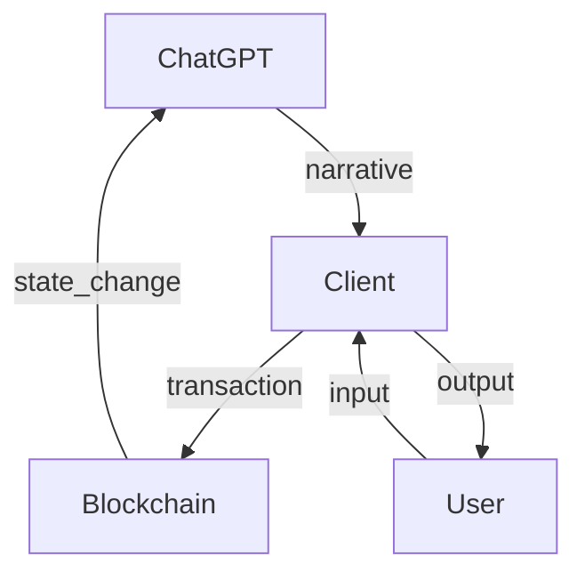

# Backend

The backend serves is a middleware that connects [our game](https://github.com/ProjectPhoenixZuzalu/project_phoenix), blockchain and [ChatGPT](https://chat.openai.com/). The server monitors and picks up transactions of our game contract and send the prompt query to ChatGPT to guide the game on the client, as shwon in the diagram. 

In our game design, ChatGPT serves as the dungeon master(DM) that narrates the story on the client side for users to interact with. All the game components are stored on-chain and ChatGPT(or any other LLMs) is only rendering on-chain data on the frontend side so the game may still considered as a fully on-chain game.
